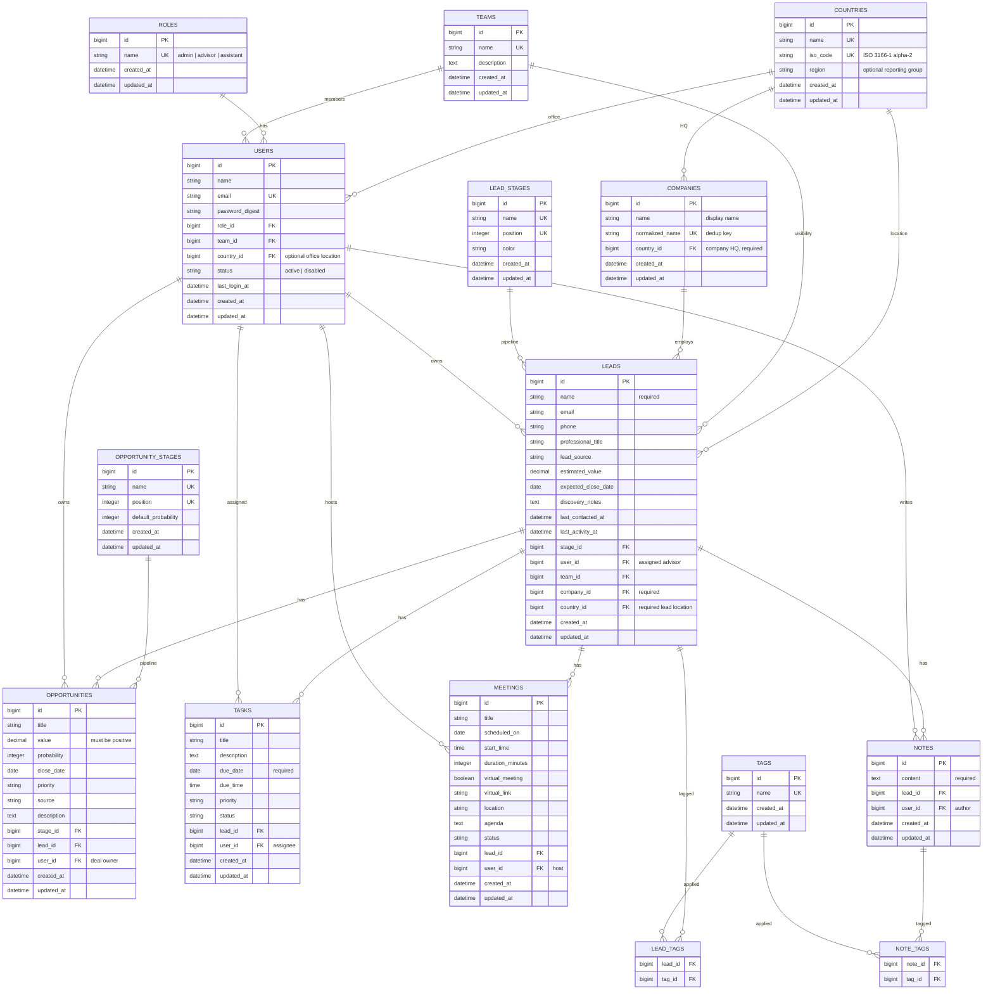

# LeadFlow CRM — Data Model (Tier 1+2)

This document describes the relational data model for LeadFlow CRM. Use it as the reference when generating migrations, models, validations, and scaffolds.

## Overview

**15 tables** (+ 2 join tables) organized around a lead-centric workflow:

| Tier | Tables |
|------|--------|
| **Tier 1** (academic README) | `Role`, `User`, `Lead`, `Opportunity`, `Task`, `Meeting`, `Note` |
| **Tier 2** (UI fidelity) | `LeadStage`, `OpportunityStage`, `Team`, `Tag`, `LeadTag`, `NoteTag` |
| **Reporting** | `Country`, `Company` |

- **User** and **Role** handle authentication and authorization
- **Lead** is the central record (linked to **Company** and **Country**)
- **Opportunity**, **Task**, **Meeting**, and **Note** are child records tied to a lead
- **Country** is a seeded reference list (no free-text country names)
- **Company** uses normalized names to prevent duplicate companies from typos

## Entity relationship diagram



## Table reference

### Tier 1 — Core

| Table | Purpose |
|-------|---------|
| `roles` | Admin / Advisor / Assistant permissions |
| `users` | Authenticated people who log in |
| `leads` | Central client/prospect record |
| `opportunities` | Sales deals linked to a lead |
| `tasks` | Follow-up to-dos with due dates (`Task` model; table `tasks`) |
| `meetings` | Scheduled client meetings |
| `notes` | Comments on a lead |

### Tier 2 — UI fidelity

| Table | Purpose |
|-------|---------|
| `lead_stages` | Lead pipeline kanban columns |
| `opportunity_stages` | Deal pipeline kanban columns |
| `teams` | Org groups for users and lead visibility |
| `tags` | Labels for leads and notes |
| `lead_tags` | Lead ↔ Tag many-to-many |
| `note_tags` | Note ↔ Tag many-to-many |

### Reporting

| Table | Purpose |
|-------|---------|
| `countries` | ISO-backed reference list — select only, never free text |
| `companies` | Normalized company records — one row per real company |

---

## Country and Company design

### Why two country fields?

| Location | Table | Required? | Used for |
|----------|-------|-----------|----------|
| **Lead country** | `leads.country_id` | **Yes** | Where the person is located |
| **Company country** | `companies.country_id` | **Yes** | Company headquarters (reporting by market) |
| **User country** | `users.country_id` | No | Advisor office location (optional) |

Example: Sarah Jenkins (lead, US) works at TechNova Solutions (HQ in Canada). Reports can group by lead country, company country, or both.

### Country — controlled list (no typos)

**Rules:**

1. Seed `countries` from ISO 3166-1 (alpha-2 codes).
2. Forms use a **dropdown** bound to `country_id` — users never type country names.
3. Only admins may add countries (if ever); normal users select from the list.

```ruby
class Country < ApplicationRecord
  has_many :companies
  has_many :leads
  has_many :users

  validates :name, presence: true, uniqueness: true
  validates :iso_code, presence: true, uniqueness: true, length: { is: 2 }
end
```

### Company — deduplication (no duplicate spellings)

**Rules:**

1. Leads reference `company_id`, not a free-text `company_name`.
2. Each company has a **display** `name` and a unique **normalized** `normalized_name`.
3. On create, use `Company.find_or_initialize_by_name(input)` so `"Acme Corp"` and `"ACME CORP"` resolve to one record.
4. UI uses **autocomplete** against existing companies; new names go through normalization.

**Normalization** (before save):

- Lowercase, trim whitespace
- Remove punctuation (`.`, `,`)
- Collapse multiple spaces
- Strip common legal suffixes (`Inc`, `LLC`, `Corp`, `Ltd`, `S.A.`, etc.)

| User enters | `normalized_name` |
|-------------|-------------------|
| Acme Corp. | `acme` |
| ACME CORP | `acme` |
| TechNova Solutions | `technova solutions` |

```ruby
class Company < ApplicationRecord
  belongs_to :country
  has_many :leads

  before_validation :set_normalized_name

  validates :name, presence: true
  validates :normalized_name, presence: true, uniqueness: true
  validates :country, presence: true

  def self.normalize_name(raw)
    return if raw.blank?

    normalized = raw.to_s.strip.downcase
    normalized = normalized.gsub(/[.,]/, " ")
    normalized = normalized.gsub(/\s+/, " ")
    normalized = normalized.gsub(/\b(inc|incorporated|llc|ltd|limited|corp|corporation|co|company|sa|s\.a\.)\b\.?/i, "")
    normalized.squish
  end

  def self.find_or_initialize_by_name(raw_name)
    normalized = normalize_name(raw_name)
    find_by(normalized_name: normalized) || new(name: raw_name.strip, normalized_name: normalized)
  end

  private

  def set_normalized_name
    self.normalized_name = self.class.normalize_name(name)
  end
end
```

**Creating a lead (controller/service pattern):**

```ruby
company = Company.find_or_initialize_by_name(params[:company_name])
company.country_id = params[:company_country_id]
company.save!

lead.assign_attributes(lead_params)
lead.company = company
lead.country_id = params[:country_id]  # required — lead's personal location
lead.save!
```

---

## Relationships

| Parent | Child | Cardinality | Description |
|--------|-------|-------------|-------------|
| `Country` | `Company` | 1 → many | Company HQ country |
| `Country` | `Lead` | 1 → many | Lead personal location |
| `Country` | `User` | 1 → many | User office location (optional) |
| `Company` | `Lead` | 1 → many | Leads at the same company |
| `Role` | `User` | 1 → many | Each user belongs to one role |
| `Team` | `User` | 1 → many | Team membership |
| `Team` | `Lead` | 1 → many | Lead visibility scope |
| `User` | `Lead` | 1 → many | Advisor assigned to leads |
| `LeadStage` | `Lead` | 1 → many | Lead pipeline stage |
| `OpportunityStage` | `Opportunity` | 1 → many | Deal pipeline stage |
| `Lead` | `Opportunity` | 1 → many | Sales opportunities |
| `Lead` | `Task` | 1 → many | Follow-up actions |
| `Lead` | `Meeting` | 1 → many | Meetings |
| `Lead` | `Note` | 1 → many | Notes |
| `Lead` | `Tag` | many → many | Via `lead_tags` |
| `Note` | `Tag` | many → many | Via `note_tags` |

## Role permissions

| Role | Leads | Opportunities | Tasks | Meetings | Notes | Users |
|------|-------|---------------|-------|----------|-------|-------|
| Admin | All | All | All | All | All | CRUD |
| Advisor | Assigned only | On assigned leads | On assigned leads | On assigned leads | On assigned leads | — |
| Assistant | Read only | Read only | Create + read | Read only | Create + read | — |

---

## Model details

### Role

```ruby
class Role < ApplicationRecord
  has_many :users, dependent: :restrict_with_error

  validates :name, presence: true, uniqueness: true
end
```

Seed: `admin`, `advisor`, `assistant`.

### Team

```ruby
class Team < ApplicationRecord
  has_many :users
  has_many :leads

  validates :name, presence: true, uniqueness: true
end
```

### User

```ruby
class User < ApplicationRecord
  belongs_to :role
  belongs_to :team, optional: true
  belongs_to :country, optional: true

  has_many :leads, dependent: :nullify
  has_many :opportunities, dependent: :nullify
  has_many :tasks, dependent: :nullify
  has_many :meetings, dependent: :nullify
  has_many :notes, dependent: :destroy

  has_secure_password

  validates :name, presence: true
  validates :email, presence: true, uniqueness: true
end
```

### LeadStage / OpportunityStage

```ruby
class LeadStage < ApplicationRecord
  has_many :leads

  validates :name, presence: true, uniqueness: true
  validates :position, presence: true, uniqueness: true
end

class OpportunityStage < ApplicationRecord
  has_many :opportunities

  validates :name, presence: true, uniqueness: true
  validates :position, presence: true, uniqueness: true
end
```

### Lead

```ruby
class Lead < ApplicationRecord
  belongs_to :user
  belongs_to :team, optional: true
  belongs_to :stage, class_name: "LeadStage"
  belongs_to :company
  belongs_to :country

  has_many :opportunities, dependent: :destroy
  has_many :tasks, dependent: :destroy
  has_many :meetings, dependent: :destroy
  has_many :notes, dependent: :destroy
  has_many :lead_tags, dependent: :destroy
  has_many :tags, through: :lead_tags

  validates :name, presence: true
  validates :country, presence: true
  validates :company, presence: true
end
```

### Opportunity

```ruby
class Opportunity < ApplicationRecord
  belongs_to :lead
  belongs_to :stage, class_name: "OpportunityStage"
  belongs_to :user

  enum :priority, { low: "low", medium: "medium", high: "high" }, validate: true

  validates :value, numericality: { greater_than: 0 }, allow_nil: true
end
```

### Task

```ruby
class Task < ApplicationRecord
  belongs_to :lead
  belongs_to :user

  enum :priority, { low: "low", medium: "medium", high: "high" }, validate: true
  enum :status, { pending: "pending", in_progress: "in_progress", completed: "completed", overdue: "overdue" }, validate: true

  validates :due_date, presence: true
end
```

### Meeting

```ruby
class Meeting < ApplicationRecord
  belongs_to :lead
  belongs_to :user

  enum :status, { scheduled: "scheduled", draft: "draft", completed: "completed", cancelled: "cancelled" }, validate: true
end
```

### Note

```ruby
class Note < ApplicationRecord
  belongs_to :lead
  belongs_to :user

  has_many :note_tags, dependent: :destroy
  has_many :tags, through: :note_tags

  validates :content, presence: true
end
```

### Tag / LeadTag / NoteTag

```ruby
class Tag < ApplicationRecord
  has_many :lead_tags, dependent: :destroy
  has_many :leads, through: :lead_tags
  has_many :note_tags, dependent: :destroy
  has_many :notes, through: :note_tags

  validates :name, presence: true, uniqueness: true
end
```

---

## Validations summary

| Model | Validation |
|-------|------------|
| `User` | `email` — presence, uniqueness |
| `Lead` | `name` — presence; `country` — presence; `company` — presence |
| `Company` | `name`, `normalized_name`, `country` — presence; `normalized_name` — uniqueness |
| `Country` | `name`, `iso_code` — presence, uniqueness |
| `Task` | `due_date` — presence |
| `Opportunity` | `value` — greater than 0 (when present) |
| `Note` | `content` — presence |

---

## Reporting queries (examples)

```sql
-- Leads by lead country
SELECT countries.name, COUNT(leads.id)
FROM leads JOIN countries ON leads.country_id = countries.id
GROUP BY countries.name;

-- Leads by company HQ country
SELECT countries.name, COUNT(leads.id)
FROM leads
JOIN companies ON leads.company_id = companies.id
JOIN countries ON companies.country_id = countries.id
GROUP BY countries.name;

-- Pipeline value by company (deduplicated)
SELECT companies.name, SUM(opportunities.value)
FROM opportunities
JOIN leads ON opportunities.lead_id = leads.id
JOIN companies ON leads.company_id = companies.id
GROUP BY companies.id, companies.name;
```

---

## Scaffold order

Generate models in dependency order:

```bash
# Reference data
bin/rails generate model Country name:string iso_code:string:uniq region:string
bin/rails generate model Role name:string:uniq
bin/rails generate model Team name:string:uniq description:text
bin/rails generate model LeadStage name:string:uniq position:integer:uniq color:string
bin/rails generate model OpportunityStage name:string:uniq position:integer:uniq default_probability:integer

# Company (depends on Country)
bin/rails generate model Company name:string normalized_name:string:uniq country:references

# Users
bin/rails generate model User name:string email:string:uniq password_digest:string role:references team:references country:references status:string last_login_at:datetime

# Lead (depends on Company, Country, LeadStage, User, Team)
bin/rails generate model Lead name:string email:string phone:string professional_title:string lead_source:string estimated_value:decimal expected_close_date:date discovery_notes:text last_contacted_at:datetime last_activity_at:datetime stage:references user:references team:references company:references country:references

# Child records
bin/rails generate model Opportunity title:string value:decimal probability:integer close_date:date priority:string source:string description:text stage:references lead:references user:references
bin/rails generate model Task title:string description:text due_date:date due_time:time priority:string status:string lead:references user:references
bin/rails generate model Meeting title:string scheduled_on:date start_time:time duration_minutes:integer virtual_meeting:boolean virtual_link:string location:string agenda:text status:string lead:references user:references
bin/rails generate model Note content:text lead:references user:references

# Tags
bin/rails generate model Tag name:string:uniq
bin/rails generate model LeadTag lead:references tag:references
bin/rails generate model NoteTag note:references tag:references

bin/rails db:migrate
```

---

## Seed data

```ruby
# db/seeds.rb

# Countries — load from ISO list (example; expand to full ISO 3166-1 set)
[
  { iso_code: "US", name: "United States", region: "North America" },
  { iso_code: "CA", name: "Canada", region: "North America" },
  { iso_code: "CR", name: "Costa Rica", region: "Central America" },
  { iso_code: "MX", name: "Mexico", region: "North America" },
  { iso_code: "GB", name: "United Kingdom", region: "Europe" },
].each do |attrs|
  Country.find_or_create_by!(iso_code: attrs[:iso_code]) { |c| c.assign_attributes(attrs) }
end

%w[admin advisor assistant].each { |name| Role.find_or_create_by!(name:) }

[
  { name: "Prospect", position: 1, color: "#6366f1" },
  { name: "Qualified", position: 2, color: "#22c55e" },
  { name: "Negotiation", position: 3, color: "#a855f7" },
  { name: "Nurturing", position: 4, color: "#f59e0b" },
  { name: "Closed", position: 5, color: "#6b7280" },
].each { |attrs| LeadStage.find_or_create_by!(name: attrs[:name]) { |s| s.assign_attributes(attrs) } }

[
  { name: "Prospect", position: 1, default_probability: 20 },
  { name: "Qualification", position: 2, default_probability: 45 },
  { name: "Proposal", position: 3, default_probability: 60 },
  { name: "Negotiation", position: 4, default_probability: 80 },
  { name: "Won", position: 5, default_probability: 100 },
  { name: "Lost", position: 6, default_probability: 0 },
].each { |attrs| OpportunityStage.find_or_create_by!(name: attrs[:name]) { |s| s.assign_attributes(attrs) } }
```

---

## Suggested indexes

| Table | Column(s) | Reason |
|-------|-----------|--------|
| `countries` | `iso_code` | Reporting joins |
| `companies` | `normalized_name` | Dedup lookup |
| `companies` | `country_id` | Report by company HQ |
| `users` | `email` | Login |
| `users` | `country_id` | Advisor location reports |
| `leads` | `country_id` | Lead location reports |
| `leads` | `company_id` | Company reports |
| `leads` | `user_id`, `stage_id` | Dashboard / pipeline |
| `tasks` | `due_date` | Overdue queries |
| `opportunities` | `stage_id`, `lead_id` | Pipeline reporting |

---

## Deferred (Tier 3+)

| Entity | Why wait |
|--------|----------|
| `Stakeholder` | Extra contacts on lead detail |
| `Activity` | Unified timeline — build from Task/Meeting/Note first |
| `MeetingAttendee` | Multi-attendee meetings |
| `Permission` | Granular role toggles in Admin UI |
| `Attachment` | File uploads on notes/opportunities |
