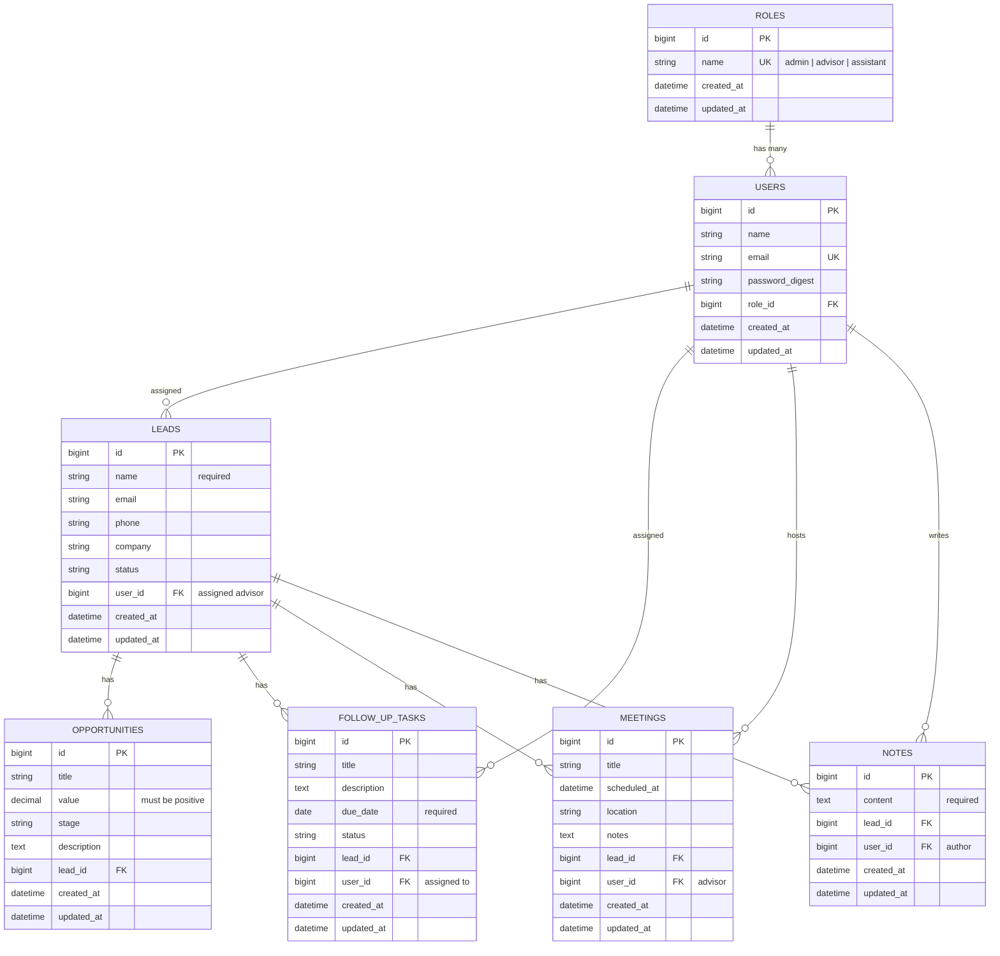
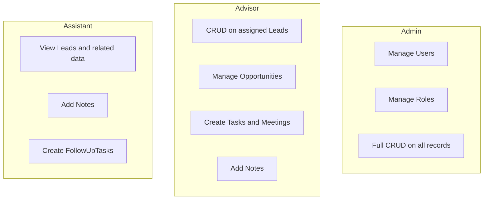

# LeadFlow CRM — Data Model

This document describes the relational data model for LeadFlow CRM. Use it as the reference when generating migrations, models, validations, and scaffolds.

## Overview

LeadFlow CRM has **7 domain models** organized around a lead-centric workflow:

- **User** and **Role** handle authentication and authorization
- **Lead** is the central record
- **Opportunity**, **FollowUpTask**, **Meeting**, and **Note** are child records tied to a lead

## Entity relationship diagram



## Relationships

| Parent | Child | Cardinality | Description |
|--------|-------|-------------|-------------|
| `Role` | `User` | 1 → many | Each user belongs to one role |
| `User` | `Lead` | 1 → many | Advisor assigned to leads |
| `User` | `FollowUpTask` | 1 → many | User responsible for the task |
| `User` | `Meeting` | 1 → many | Advisor hosting the meeting |
| `User` | `Note` | 1 → many | User who wrote the note |
| `Lead` | `Opportunity` | 1 → many | Sales opportunities for a lead |
| `Lead` | `FollowUpTask` | 1 → many | Follow-up actions for a lead |
| `Lead` | `Meeting` | 1 → many | Meetings with a lead |
| `Lead` | `Note` | 1 → many | Notes on a lead |

## Role permissions



| Role | Leads | Opportunities | Tasks | Meetings | Notes | Users |
|------|-------|---------------|-------|----------|-------|-------|
| Admin | All | All | All | All | All | CRUD |
| Advisor | Assigned only | On assigned leads | On assigned leads | On assigned leads | On assigned leads | — |
| Assistant | Read only | Read only | Create + read | Read only | Create + read | — |

## Model details

### Role

Defines system permissions. Seed three records: `admin`, `advisor`, `assistant`.

```ruby
class Role < ApplicationRecord
  has_many :users, dependent: :restrict_with_error

  validates :name, presence: true, uniqueness: true
end
```

### User

Authenticated system user. Uses `has_secure_password` (requires `bcrypt` gem).

```ruby
class User < ApplicationRecord
  belongs_to :role
  has_many :leads, dependent: :nullify
  has_many :follow_up_tasks, dependent: :nullify
  has_many :meetings, dependent: :nullify
  has_many :notes, dependent: :destroy

  has_secure_password

  validates :name, presence: true
  validates :email, presence: true, uniqueness: true
end
```

### Lead

Central record representing a prospective or active client.

```ruby
class Lead < ApplicationRecord
  belongs_to :user
  has_many :opportunities, dependent: :destroy
  has_many :follow_up_tasks, dependent: :destroy
  has_many :meetings, dependent: :destroy
  has_many :notes, dependent: :destroy

  enum :status, {
    new_lead: "new",
    contacted: "contacted",
    qualified: "qualified",
    lost: "lost"
  }

  validates :name, presence: true
end
```

### Opportunity

Sales opportunity linked to a lead. Tracks pipeline stage and monetary value.

```ruby
class Opportunity < ApplicationRecord
  belongs_to :lead

  enum :stage, {
    prospecting: "prospecting",
    proposal: "proposal",
    negotiation: "negotiation",
    won: "won",
    lost: "lost"
  }

  validates :value, numericality: { greater_than: 0 }, allow_nil: true
end
```

### FollowUpTask

Scheduled follow-up action for a lead.

```ruby
class FollowUpTask < ApplicationRecord
  belongs_to :lead
  belongs_to :user

  enum :status, {
    pending: "pending",
    completed: "completed",
    overdue: "overdue"
  }

  validates :due_date, presence: true
end
```

### Meeting

Meeting scheduled with a lead.

```ruby
class Meeting < ApplicationRecord
  belongs_to :lead
  belongs_to :user
end
```

### Note

Note or comment attached to a lead.

```ruby
class Note < ApplicationRecord
  belongs_to :lead
  belongs_to :user

  validates :content, presence: true
end
```

## Validations summary

| Model | Validation |
|-------|------------|
| `User` | `email` — presence, uniqueness |
| `Lead` | `name` — presence |
| `FollowUpTask` | `due_date` — presence |
| `Opportunity` | `value` — greater than 0 (when present) |
| `Note` | `content` — presence |

## Scaffold order

Generate models in dependency order:

```bash
bin/rails generate model Role name:string:uniq

bin/rails generate model User name:string email:string:uniq role:references password_digest:string

bin/rails generate model Lead name:string email:string phone:string company:string status:string user:references

bin/rails generate model Opportunity title:string value:decimal stage:string description:text lead:references

bin/rails generate model FollowUpTask title:string description:text due_date:date status:string lead:references user:references

bin/rails generate model Meeting title:string scheduled_at:datetime location:string notes:text lead:references user:references

bin/rails generate model Note content:text lead:references user:references

bin/rails db:migrate
```

## Seed data

```ruby
# db/seeds.rb
%w[admin advisor assistant].each do |name|
  Role.find_or_create_by!(name:)
end
```

## Suggested indexes

| Table | Column(s) | Reason |
|-------|-----------|--------|
| `users` | `email` | Unique lookup at login |
| `users` | `role_id` | Filter users by role |
| `leads` | `user_id` | Advisor dashboard queries |
| `leads` | `status` | Filtering |
| `leads` | `name`, `email`, `company` | Search |
| `follow_up_tasks` | `due_date` | Overdue task queries |
| `follow_up_tasks` | `lead_id`, `user_id` | Scoped listings |
| `meetings` | `scheduled_at` | Calendar views |
| `opportunities` | `lead_id`, `stage` | Pipeline reporting |
